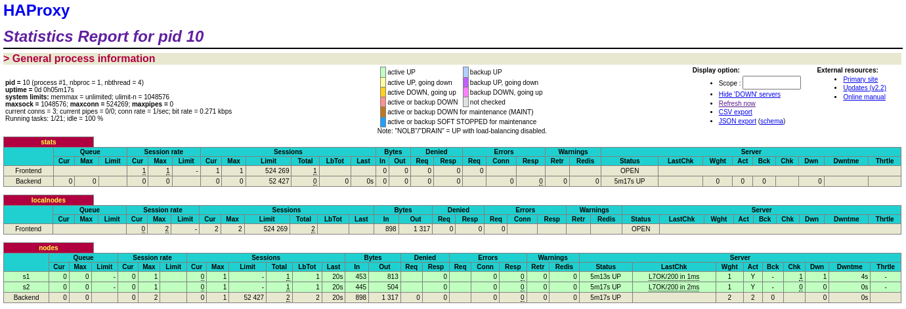
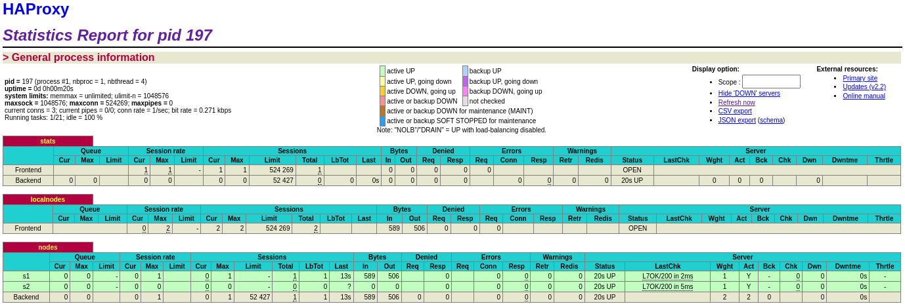
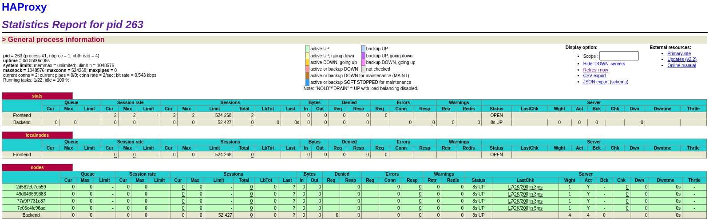

# AIT - Lab 04 - Docker

Auteurs : Godi Matthieu, Issolah Maude, Tevaearai Rébecca 

Date : 12.01.2022


- [AIT - Lab 04 - Docker](#ait---lab-04---docker)
  * [Introduction](#introduction)
  * [Task_0](#task-0)
  * [Task_1](#task-1)
  * [Task_2](#task-2)
  * [Task_3](#task-3)
  * [Task_4](#task-4)
  * [Task 5](#task-5)
  * [Task_6](#task-6)
  * [Difficultés](#difficult-s)
  * [Conclusion](#conclusion)


## Introduction
Ce laboratoire à pour objectif de nous faire expérimenter une infrastructure de load balancing utilisable en production, basé sur des conteneurs Docker. L'objectif est de mettre en place une infrastructure dynamique et évolutive.

Nous verrons aussi comment utiliser Docker de façon plus avancée, avec l'optimisation de la taille des images, et la mise en place d'un superviseur de processus qui nous permet de contourner la limitation de Docker qui impose de n'avoir qu'un seul processus actif qui défini l'état du conteneur.


## Task_0

**Identify issues and install the tools**


[M1] Do you think we can use the current solution for a production environment? 

What are the main problems when deploying it in a production environment?

> Non, car notre infrastructure n'est pas modulable. 
>
> Les adresses ip des conteneurs sont enregistrées en dur dans la config du reverse proxy, ce qui demande de le mettre à jour manuellement lors de chaque ajout/suppression d'un conteneur.


[M2] Describe what you need to do to add new webapp container to the infrastructure. Give the exact steps of what you have to do without modifiying the way the things are done. Hint: You probably have to modify some configuration and script files in a Docker image.

> Le plus simple serait de modifier le fichier *docker-compose.yml* et d'y ajouter une application sur le modèle des deux déjà existantes (en ajoutant les nouvelles variables d'environnement dans le fichier .env). Mais pour cela il faut supprimer tous les conteneurs et les recréer ce qui rend le service indisponible durant le temps du processus.
>
> Une autre solution est de créer une webapp, puis de l'ajouter dans la config de HAproxy. 
>
> Le service sera indisponible juste le temps de relancer le service HAproxy ce qui est bien plus rapide.
>
> Pour pouvoir configurer les paramètres réseaux, il faut utiliser un fichier *docker-compose.yml* placé dans le dossier *webapp* comme ci-dessous.
>
> ````
> version: "3.5"
> 
> services :
>   webapp3:
>        container_name: s3
>        build:
>          context: .
>          dockerfile: Dockerfile
>        networks:
>          heig:
>            ipv4_address: 192.168.42.33
>        ports:
>          - "4003:3000"
>        environment:
>             - TAG=s3
>             - SERVER_IP=192.168.42.33
> ````
>
> Il faut faire attention a ne pas utiliser un port déjà utilisé pour le bind (ici 4003).
>
> Après la création du conteneur avec la commande `docker-compose up -d --build` il faut modifier la configuration de HAproxy pour y ajouter ce nouveau noeud.
>
> Fichier `/usr/local/etc/haproxy/haproxy.cfg`:
>
> ````
>     # HANDLEBARS START
>     # TODO: [CFG] Remove all the servers
>     server s1 ${WEBAPP_1_IP}:3000 check
>     server s2 ${WEBAPP_2_IP}:3000 check
>     server s3 192.168.42.33:3000 check
>     # HANDLEBARS STOP
> ````
>
> Pour finir, il suffit de redémarrer HAproxy pour que cette nouvelle configuration soit prise en compte.


[M3] Based on your previous answers, you have detected some issues in the current solution. Now propose a better approach at a high level.
> Une meilleure approche serait d'avoir une configuration dynamique, ou les nœuds sont ajoutés/supprimés du loadbalancer automatiquement.


[M4] You probably noticed that the list of web application nodes is hardcoded in the load balancer configuration. How can we manage the web app nodes in a more dynamic fashion?
> Il faudrait le loadbalancer et les webapps utilisent un système de communication qui permettent aux nouveaux nœuds de s'annoncer. Dans l'idée du broadcast, les webapps envoient un message sur le réseau pour s'annoncer.


[M5] In the physical or virtual machines of a typical infrastructure we tend to have not only one main process (like the web server or the load balancer) running, but a few additional processes on the side to perform management tasks.

For example to monitor the distributed system as a whole it is common to collect in one centralized place all the logs produced by the different machines. Therefore we need a process running on each machine that will forward the logs to the central place. (We could also imagine a central tool that reaches out to each machine to gather the logs. That's a push vs. pull problem.) It is quite common to see a push mechanism used for this kind of task.

Do you think our current solution is able to run additional management processes beside the main web server / load balancer process in a container? If no, what is missing / required to reach the goal? If yes, how to proceed to run for example a log forwarding process?
> Non, nous ne pouvons pas ajouter de processus, car selon la politique de Docker, un conteneur = un processus, et si le processus est stoppé, le conteneur aussi.
>
> Pour pouvoir en ajouter il faut un processus parent qui lance les processus enfants (*process supervisor*), de ce fait nous auront toujours un processus actif et le conteneur ne sera pas arrêté.


[M6] In our current solution, although the load balancer configuration is changing dynamically, it doesn't follow dynamically the configuration of our distributed system when web servers are added or removed. If we take a closer look at the run.sh script, we see two calls to sed which will replace two lines in the haproxy.cfg configuration file just before we start haproxy. You clearly see that the configuration file has two lines and the script will replace these two lines.

What happens if we add more web server nodes? Do you think it is really dynamic? It's far away from being a dynamic configuration. Can you propose a solution to solve this?
> Si on ajoute des nœuds sans modifier la configuration du loadbalancer, ils ne seront pas ajouté au cluster.
>
> Une solution serait une configuration dynamique comme discuté dans la question [M4].




<div style="text-align: center;font-style: italic;font-size: 12px;">HAProxy stats</div>


Repo GitHub: https://github.com/issolahma/Teaching-HEIGVD-AIT-2020-Labo-Docker


## Task_1

**Add a process supervisor to run several processes**



<div style="text-align: center;font-style: italic;font-size: 12px;">HAProxy stats</div>

Describe your difficulties for this task and your understanding of what is happening during this task. Explain in your own words why are we installing a process supervisor. Do not hesitate to do more
research and to find more articles on that topic to illustrate the problem.

> La mise en place de Cette tâche n'a pas posé de difficulté, car la documentation du labo était très détaillée.
>
> Nous avons ajouté un *process supervisor* `S6` à nos conteneur pour pouvoir y lancer plusieurs process, car la philosophie de Docker est que chaque conteneur ne doit avoir qu'un seul process actif. Si se process se termine, le conteneur s'arrête.
>
> C'est lui qui est lancé au démarrage du conteneur, et qui est chargé de lancer le service de l'application, et dans la suite du labo le processus qui permettra la gestion dynamique du cluster.


## Task_2

**Add a tool to manage membership in the web server cluster**

1. Give the answer to the question about the existing problem with the current solution.

   >Nous n'avons pas mis en place les méthodes qui permettent de joindre ou quitter le cluster dynamiquement, de ce fait notre système ne peut pas fonctionner. 
   >
   >Il faudrait que toutes les machines soient up en même temps, ce qui n'est pas possible.

   

1. Give an explanation on how `Serf` is working. Read the official website to get more details about the `GOSSIP` protocol used in `Serf`. Try to find other solutions that can be used to solve
   similar situations where we need some auto-discovery mechanism.
   
   >Lorsque HAProxy est lancé, `Serf` envoi régulièrement des messages broadcast sur le réseau pour trouver les machines configurées dans le cluster (configurées en dur à cette étape).
   >
   >Un fois la machine en ligne, elle s'annonce sur le réseau en répondant au message ARP, ce qui permet au reverse proxy de la contacter, et d'établir une connexion `TCP`.
   >
   >Pour détecter les machines qui seraient tombées, `Serf` tente régulièrement une connexion `TCP` sur les machines qu'il a ajouté au cluster, s'il n'y a pas de réponse au `SYN`, il considère qu'elles sont down.
   >
   >Le protocole `GOSSIP` fonctionne sur `UDP` et il envoi en permanence des messages aux nœuds du cluster pour vérifier leur présence. Ce protocole fonctionne sur le principe des rumeurs, un nœud va envoyer son message à *x* autre nœuds selon la config, qui eux-même renverront ce message à *x* nœuds. Cela permet une diffusion rapide du message.
   >
   >
   >
   >Comme autre solution de découverte, nous pourrions utiliser `Traefik` (https://doc.traefik.io/traefik/) qui permet de gérer des clusters en ne travaillant que sur la couche Docker pour détecter de nouveau nœuds.


**Deliverables**

- [Task2 logs folder](../logs/Task2)

  

## Task_3

**React to membership changes**


**Deliverables**

- [Task3 logs folder](../logs/Task3)

  

## Task_4

**Use a template engine to easily generate configuration files**


1. You probably noticed when we added `xz-utils`, we have to rebuild the whole image which took some time. What can we do to mitigate that? 
   
   > Nous pouvons créer une nouvelle image basée sur la précédente (FROM ...), et y ajouter les outils voulus.
   
   
   
   
   Tell us about the pros and cons to merge as much as possible of the command. In other words, compare:
   
   ```
   RUN command 1
   RUN command 2
   RUN command 3
   ```
   
   vs.
   
   ```
   RUN command 1 && command 2 && command 3
   ```
   
   > Chaque ligne/commande du dockerfile créer une nouvelle couche. 
   >
   > Passer toutes nos commandes sur un seul `RUN` permet de réduire la taille de l'image, et accélère le processus, car une seule nouvelle couche est créée.
   >
   > Utiliser plusieurs `RUN` rend le fichier plus lisible, et plus facile a débugger, car si le message d'erreur n'est pas clair, nous savons quelle commande pose problème.
   
   

There are also some articles about techniques to reduce the image size. Try to find them. They are talking about `squashing` or `flattening` images.

2. Propose a different approach to architecture our images to be able to reuse as much as possible what we have done. Your proposition should also try to avoid as much as possible repetitions between your images.

   > La première étape pour réduire la taille du conteneur, est de choisir une image de base la plus petite possible. En utilisant une base Alpine Linux nous réduisons considérablement la taille de départ.
   >
   > Le conteneur HAProxy passe de 358MB à 256MB
   >
   > Le conteneur WebApp passe de 1.13Gb à 325MB
   >
   > Les fichiers dockerfile modifiées sont dans les dossiers `ha` et `webapp`.
   >
   > 
   >
   > Lors de la création de l'image nous voyons les IDs des couches créées. Il est possible de créer une nouvelle image en partant d'une de ces couches ce qui accélère le processus de création.
   >
   > 
   >
   > L'option `--squash` qui fusionne toutes les couches en une, peut réduire la taille de l'image finale. Dans notre cas, nous n'avons pas vu de différence significative, nos images gagnent environs 20MB.
   >
   > 
   >
   > La construction d'une image en *multi-stage* est très efficace si nous utilisons un conteneur pour compiler notre application. Nous pouvons créer notre app dans une image, puis la copier dans une autre qui n'aura que le stricte nécessaire pour l'exécuter. (`COPY --from=imgName`).
   >
   > Ici, nous avons déjà l'application, de ce fait nous n'y gagnons rien.

   

4. Based on the three output files you have collected, what can you say about the way we generate it? What is the problem if any?
   
   > Les fichiers sont crées dans le dossier /tmp qui est vidé lors de extinction de la machine. De ce fait nous n'avons pas d'historique si nous ne les déplaçons pas. 
   >
   > De plus, l'utilisation de la commande `>` écrase le fichier avec le nouveau log.
   >
   > Il serait plus pertinent de les générer dans un dossier *logs* et d'utiliser la commande `>>` qui ajoute le nouveau texte au fichier sans rien écraser. Il pourrait aussi être utile d'ajouter la date et heure d'ajout du log dans la liste.
   


**Deliverables**

- [Task4 logs folder](../logs/Task4)

  

## Task 5

**Generate a new load balancer configuration when membership changes**


**Deliverables**

- [Task5 logs folder](../logs/Task5)


## Task_6

**Make the load balancer automatically reload the new configuration**




<div style="text-align: center;font-style: italic;font-size: 12px;">HAProxy stats avec 4 nœuds</div>


Give your own feelings about the final solution. Propose improvements or ways to do the things differently. If any, provide references to your readings for the improvements.

> Notre solution demande d'implémenter l'infrastructure dans nos conteneurs, ce qui les rends plus lourd que s'ils n'avaient que l'application.
>
> Dans un labo du cours RES nous avions utilisé *Traefik* pour faire du load balancing. *Traefik* gère les conteneur via l'API Docker, et nous ne devons pas modifier le contenu de ces  derniers. 
>
> Avec beaucoup de nœuds, nous gagnons significativement en taille. De plus, si nous voulons modifier la configuration, nous ne devons modifier que celle de *Traefik*.


**Deliverables:**

[Task6 logs folder](../logs/Task6)


## Difficultés

La partie pratique de ce laboratoire a été facile, car la documentation était très détaillée.

La partie théorique a demandé des recherches, ce qui prend du temps, mais n'est pas difficile en soit.


## Conclusion

Toute la partie en lien avec Docker a été très interessante. 

C'était la première fois que nous nous y interessions de façon plus avancée, notamment sur les possibilités d'optimisation de la taille des images, et l'utilisation des différentes couches.

Il a aussi été interessant de découvrir de nouvelles téchnologies comme `s6` et `serf`.
